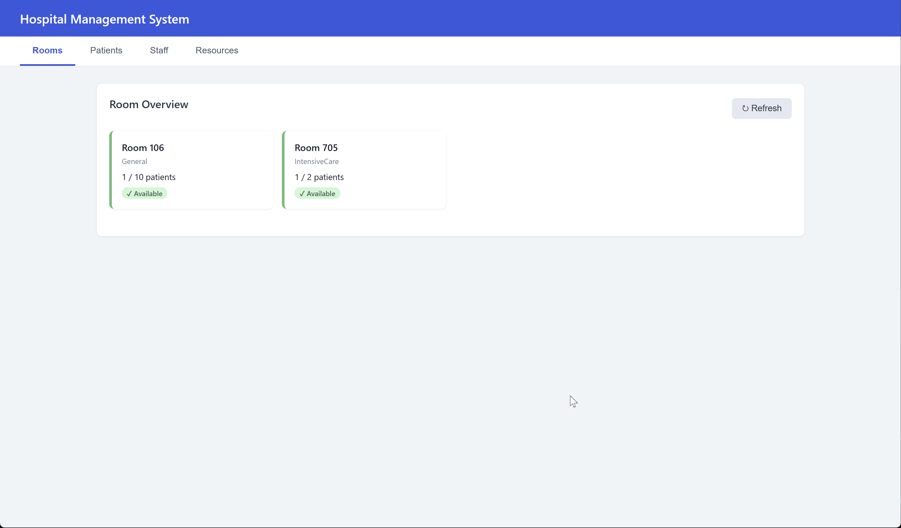

# Hospital Management System

A distributed hospital operations platform built on a C++ microservices backend with gRPC, offering both a web GUI and a terminal CLI for managing patients, staff, rooms, and resources in real time.

## Demo



## Why We Built It

Hospital operations involve tightly coupled workflows across departments that break down quickly without reliable coordination. This system decouples those concerns into independently deployable services that communicate over gRPC, making each domain (patients, staff, rooms, resources, scheduling) fault-isolated and independently scalable. The technically interesting challenge was designing a shared Protobuf contract layer that both a C++ CLI and a Python/FastAPI web frontend could consume without duplication.

## Tech Stack

| Layer | Technology |
|---|---|
| Backend services | C++23, CMake |
| Inter-service communication | gRPC + Protocol Buffers |
| GUI frontend | Python, FastAPI, HTML/JS |
| CLI frontend | C++ |
| Persistence | JSON file store per service |
| Orchestration | Docker Compose (7 containers) |

## Features

- Manage patient records: admit, discharge, and track patient status across the system
- Allocate and monitor hospital rooms with real-time availability tracking
- Control medical resource inventory and flag shortages before they occur
- Schedule and manage staff assignments across shifts and departments
- Choose between a browser-based GUI (port 8920) or a full-featured terminal CLI
- One-command startup via `run.sh` with Docker handling all build and dependency setup

## How to Run

**Prerequisites:** Docker Desktop installed. A stable internet connection is required on first run -- Docker pulls and compiles the base image, which can take over an hour depending on your machine's RAM and CPU allocation.

**Start the system:**

```bash
# GUI (web frontend at http://localhost:8920)
./run.sh gui

# CLI (terminal interface)
./run.sh cli
```

On Windows, run via Git Bash:

```bash
bash run.sh gui
```

The `run.sh` script builds all service images and starts the full stack via Docker Compose. No manual dependency installation required.

## Contributors

- [Victor S](https://github.com/amiothenes)
- [Matthew H](https://github.com/M4TT905)
- [Olamide T](https://github.com/olamidetim21)
- [Hachi N](https://github.com/hachy-kc)
